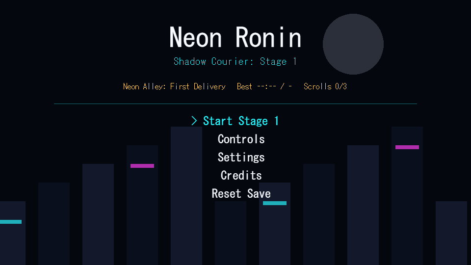
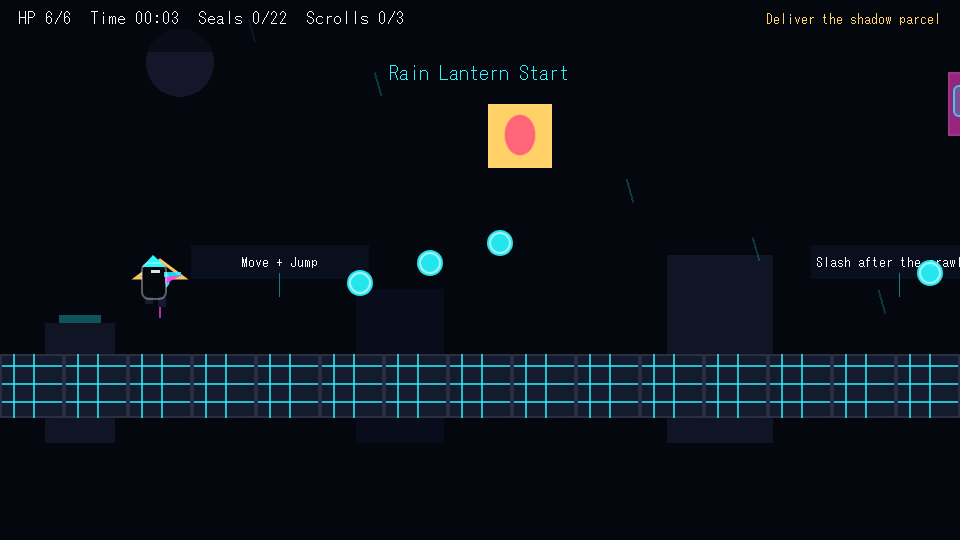
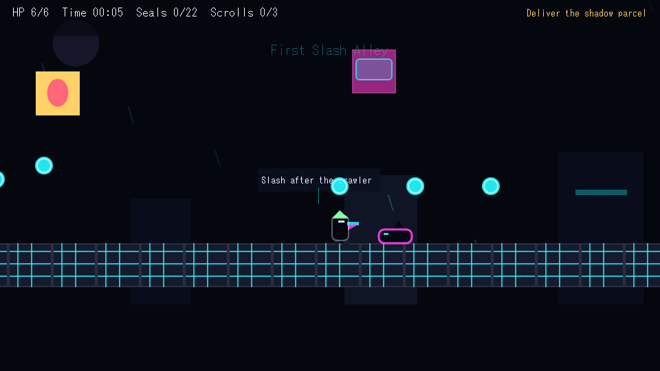
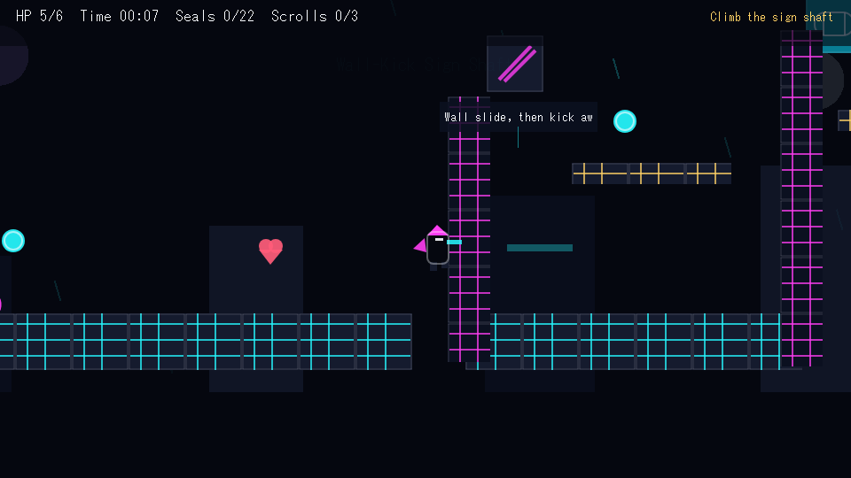
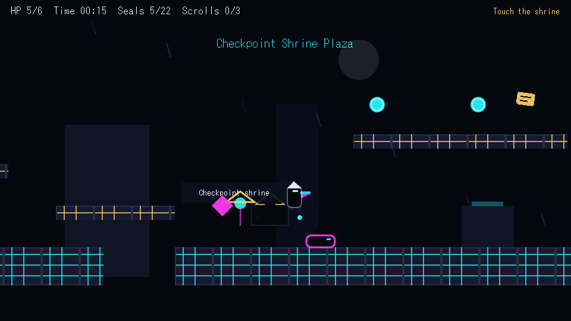
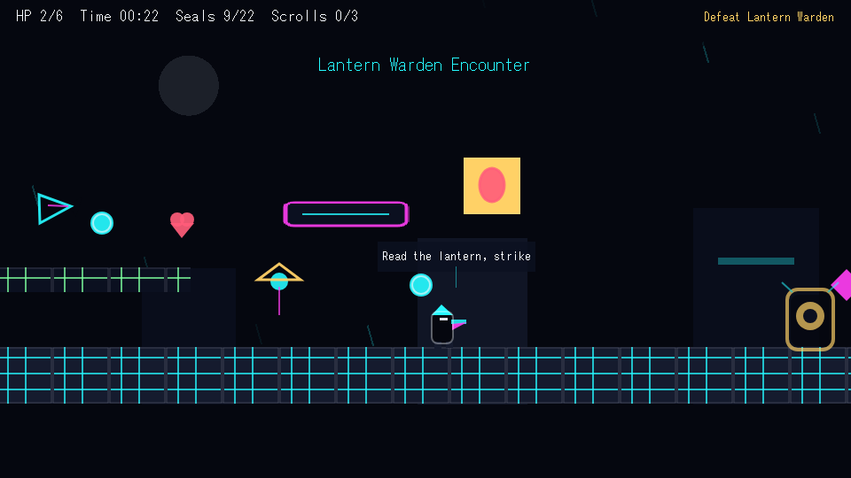
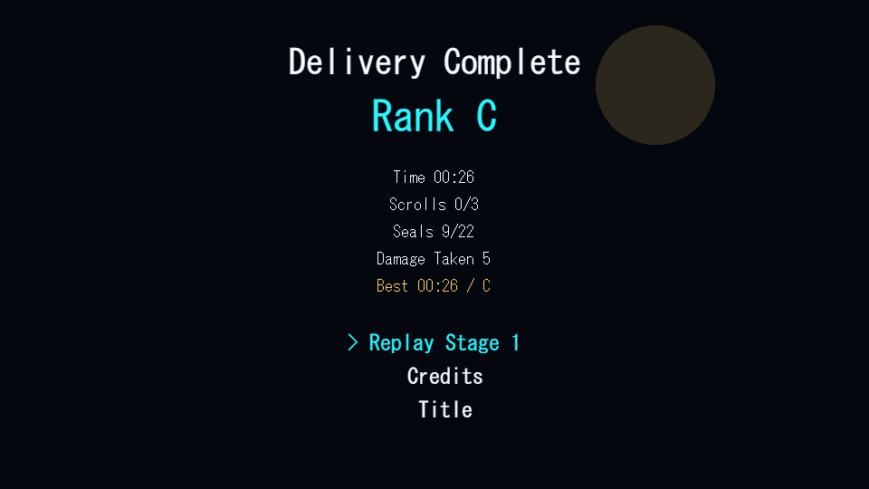
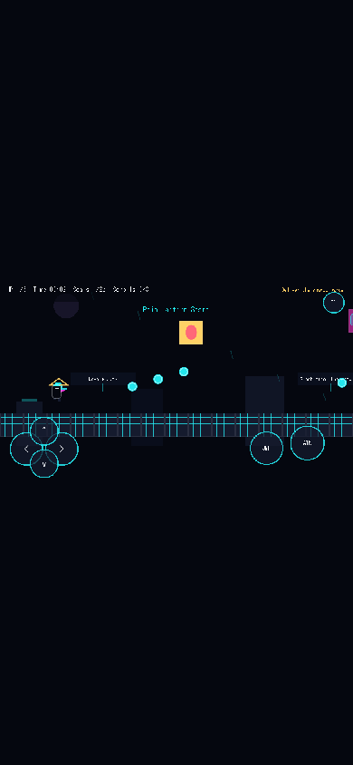

# Neon Ronin: Shadow Courier

Stage 1 vertical slice for a browser-based 2D ninja action platformer.

The current build contains one complete stage only: **Stage 1 — Neon Alley: First Delivery**. The player carries a sealed message through a rain-lit cyber alley, learns jump timing, wall kick, slash combat, checkpoints, optional scroll routes, a hazard run, and the Lantern Warden miniboss before reaching the Moon Gate.

## Run

Use Node 24, matching `.nvmrc` and the GitHub Pages workflow.

```bash
npm install
npm run dev
```

The dev server prints a local Vite URL. Production preview:

```bash
npm run build
npm run preview
```

## Controls

- Move: `A/D` or arrow keys
- Jump / wall kick: `W`, `Up`, or `Space`
- Slash: `J` or `Z`
- Pause: `Esc` or `P`

Mobile uses the same input system through virtual controls: left/right/up/down on the left pad, jump/attack on the right, and pause in the upper-right safe area.

## Quality Gates

Required checks:

```bash
npm run typecheck
npm run test
npm run build
npm run e2e
npm run qa:level
npm run qa:assets
npm run qa:bundle
npm run qa:dist
npm run qa:screenshots
npm run qa:playtest
npm run qa:all
```

`npm run e2e` launches Playwright, opens the game, validates title/controls/settings flow, verifies saved and visible high contrast mode, verifies pause-menu Retry Checkpoint and Restart Stage actions, clears Stage 1 with keyboard controls, records route-health thresholds, verifies Stage Clear data, and checks mobile virtual-control layout plus input probes in a 390x844 viewport.

`npm run qa:screenshots` regenerates the browser evidence under `artifacts/qa/`.

`npm run qa:dist` serves the built `dist/` directory and verifies the production bundle boots from Title to Stage 1 without dev-server fallback. Set `QA_DIST_BASE=/repo-name/` to smoke a GitHub Pages-style base path.

`npm run qa:playtest` writes an evidence-backed tuning note from current route-health, level, dist, mobile layout, and screenshot reports.

## QA Screenshots

















Additional evidence:

- `artifacts/qa/controls.png`
- `artifacts/qa/settings.png`
- `artifacts/qa/movement-tutorial.png`
- `artifacts/qa/console-report.json`
- `artifacts/qa/e2e-report.json`
- `artifacts/qa/bundle-report.json`
- `artifacts/qa/dist-report.json`
- `artifacts/qa/playtest-tuning.md`
- `artifacts/qa/stage1-acceptance-report.md`

## Stage 1 Contents

- 10 named sections, including Rain Lantern Start, First Slash Alley, Wall-Kick Sign Shaft, Checkpoint Shrine Plaza, Neon Thorn Run, Lantern Warden Encounter, and Moon Gate Finish
- 3 checkpoints
- 3 hidden scrolls
- 22 seal pickups
- 5 regular enemy encounters
- Lantern Warden miniboss
- Neon thorns, spark/falling sign hazards, and fall rescue
- Stage 1 best time, rank, scrolls, cleared flag, and settings saved locally

## Asset And Audio Policy

No external runtime assets are used. Visuals are generated in Phaser from local procedural drawing code. SFX are generated with WebAudio and controlled by the saved volume/mute settings.

If external assets are added later, they must be permissively licensed, committed locally, and documented before use.

## Known Limitations

- This is a Stage 1 vertical slice, not a full multi-stage campaign.
- Procedural art is polished enough for QA evidence but not final hand-drawn production art.
- Music is not implemented; only distinct SFX are present.
- The automated clear route is optimized and faster than a first-time human route.

## Future Roadmap

- Replace procedural character art with authored sprite sheets.
- Add richer enemy animation frames and ambient audio.
- Tune a second-stage concept only after Stage 1 remains stable under the QA gates.
- Expand accessibility options after validating the current mobile control layout with real devices.
